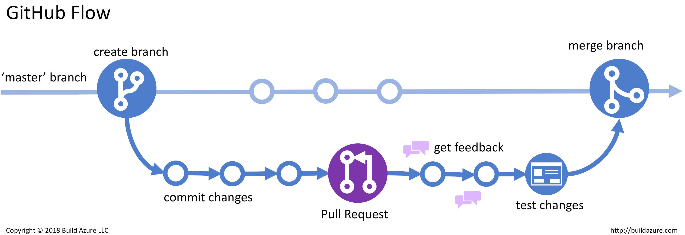

# python
This repository to document my work of teaching Catherine Python including any tools she might need to learn Python.

## non-python topics
* shells - terminals
* brew macOS package manager
* text editors
* markdown
* git - github

## python topics
* virtual environments
* pip
* functions
* testing
* exercism.io

## shells - terminals
### shells
* [shells](https://en.wikipedia.org/wiki/Shell_(computing)) are programs that allow users to interact with the operating system
* are named shells because they are the outermost layer around the operating system
* shells use either:
    - a command-line interface (CLI)
    - or graphical user interface (GUI)
* for the purpose of this tutorial when we are going to refer to shells we are going to refer to the cli shells
* the shell is both an interactive command language and a scripting language
* for now we will focus on the shell as an interactive command language
* there are many flavours of shells
* the most popular shells are:
    - bash: the default Linux shell
    - zsh: the default shell of the latest macOS (Big Sur)
* many aspects of bash and zsh are similar and for the purpose of this tutorial we are going to ignore their differences

### terminals
* [terminal emulators](https://en.wikipedia.org/wiki/Terminal_emulator) are computer programs that emulate [video terminals](https://en.wikipedia.org/wiki/Computer_terminal#Dumb_terminals)
* for the purpose of this tutorial when we are going to refer to terminal emulators as terminals
* your terminal lets you interact with your shell which through commands lets you interact with your operating system to perform various tasks e.g.:
    - creating, copying, moving, renaming, removing files and directories
    - download stuff
    - launch programs
* the most popular terminals are:
    - terminal: comes by default with macOS
    - [iTerm2](https://iterm2.com/): has more features then the default terminal that comes with interactive command language

### terminal - shell - os
* terminal - shell - os interaction: `user --> terminal --> shell --> commands --> operating system --> apps or hardware`
* to find out your shell you can execute the `echo $SHELL` in your terminal
```sh
## example running the echo command to find your default shell
❯ echo $SHELL
/usr/local/bin/bash
```

### bash commands syntax
* the basic syntax of a bash command is `command [flags] [subcommands] [flags] [argument]` - whatever is brackets enclosed is optional
* in many cases the command, subcommands and flags stand for something making it easier to remember e.g.:
    - `ls`: list
    - `-l`: long
* flags:
    - most of the time are optional
    - both commands and subcommands can have their own flags
    - they modify how a command/subcommand works
    - some flags come in two different forms - when they do they are equivalent:
        + short which must be prepended by `-`: `-v`
        + long: which must be prepended by `--`: `--verbose`
    - multiple short flags can be combined after one `-` e.g. the following are equivalent:
        + `ls -l -a -h`
        + `ls -lah`
* subcommands:
    - sometimes when a command is too complex whoever writes (makes or provides) the command brakes it into 1 command and one ore more subcommands
* arguments:
    - it is whatever the command or subcommand acts upon, e.g. `git clone` command and subcommand act upon an URL downloading it

```sh
# YOU CAN EXECUTE THESE COMMANDS INSIDE A TEST DIRECTORY TO SEE HOW FLAGS MODIFY ITS SUBCOMMAND BEHAVIOR
# command subcommand subcommandFlag  argument
git       clone                      https://github.com/molcathy/python.git
git       clone      -q              https://github.com/molcathy/python.git
git       clone      --quiet         https://github.com/molcathy/python.git
```

## useful bash commands
* there are probably thousands of bash commands, but we are focus on the most basic one of [the most important ones](https://www.google.com/search?q=most+important+bash+commands)
```sh
## print working directory i.e. current directory
pwd

## list files and directories
ls
ls -a    # list hidden files
ls -h    # list in pretty format
ls -a    # list in long format
ls -lah  # list with all 3 flags combined


## make directory
mkdir myDirectory

## change working directory - NOTE: note multiple directory names or files are separated by /
cd myDirectory
cd myDirectory1/myDirectory2
cd /myDirectory1/myDirectory2

## list directories and files recursively as a tree
tree
tree -d     # list directories only
tree -L 3   # limit the number of directories and files you want displayed, here 3
tree -dL 3
tree --help # ! NOTE: often commands come with --help or -h flags that display a help menu

## remove files & directories
rm -vi myFile  # remove file verbosely asking for confirmation
#!!!!!!!!!!!!!!!!!!!!!!!!!!!!!!!!!!!!!!!!!!!!!!!!!!!!!!!!!!!!!!!!!!!!!!!!
rm -rf myDir   # DANGER THIS COMMAND CAN REMOVE YOUR ENTIRE FILE SYSTEM
               # NEVER run rm -rm ON A ABSOLUTE PATH i.e. starting with /
#!!!!!!!!!!!!!!!!!!!!!!!!!!!!!!!!!!!!!!!!!!!!!!!!!!!!!!!!!!!!!!!!!!!!!!!!

## check if myCommand is installed and its path
which myCommand
```

## brew macOS package manager
* only _some_ commands come preinstalled with an OS (**O**perating **S**ystem)  and that is the case for macOS
* on macOS you can install additional bash commands with [brew](https://brew.sh/) e.g. `brew install tree`
* brew itself must be installed first since it does not come by default with macOS
* to install brew follow instructions at https://brew.sh/
* brew is a macOS cli package manger i.e. software that manges other software:
    - lists installed software
    - installs additional software
    - updates installed software
    - removes installed software
* brew lets you mange both cli and gui software (with the `--cask` flag)
* you can
```sh
## LISTS INSTALLED PACKAGES
brew list          # cli
brew list --cask   # gui

## INSTALL PACKAGES
brew install git
brew install --cask firefox

## UPDATE & UPGRADE ALL INSTALLED PACKAGES
bre update
brew upgrade

## REMOVE PACKAGES
 # uninstall & remove are equivalent
brew uninstall myPackage
brew remove myPackage
```

## text editors
* text editors are programs used to edit plain text and can be used to write python programs
* some of the most popular text editors that run on macOS (and likely on windows and linux) are:
    - [sublime text](https://www.sublimetext.com/)
    - [atom](https://atom.io/)
    - [visual studio code or vscode](https://code.visualstudio.com/)
    - vim the only text editor from in this list that:
        + is a **cli** text editor
        + comes by default installed on macOS

* likely all of these text editors can be installed either:
    - downloading the installer form the software vendor's website
    - with brew

### text editors vs word processors vs IDEs
* word processors:
    - e.g. 'MS Word' are not suitable for writing code
    - they are meant to visually edit text
    - they add hidden instructions that interfere with code execution
* text editors like the ones listed above:
    - have features that facilitate writing code e.g.:
        + syntax highlighting
        + linting
        + auto saving
        + projects management
        + terminal/shell access
        + integrate with git/github
    - some of the above features come by default with the text editors whereas others are provided by plugins you have to install
* IDE (Integrated Development Environment):
    - same as text editors are suitable for writing programs
    - in general, IDEs have more built-in features compared with text editors
    - the complexity of IDEs means they have a steeper learning curve
    - the complexity and stepper learning curve of IDEs can distract from leaning the actual language - in general, they should be only used once you are pretty conformable with the most common aspects of the language you are learning
    - one of the best python IDE is [PyCharm](https://www.jetbrains.com/pycharm/) which has both a free and a paid version

### vscode
* for this tutorial we shall use vscode
* vscode has many features:
    - syntax highlighting for many langues including python
    - linting
    - git/github integration
    - project management
    - multiple line cursor
    - automatic detection of local github repositories
    - project management
    - comes with command `code` which an be used to open files or directories into code

```sh
## cd into your python project
cd myPythonProject

## open current directory in vscode
code .
```

## markdown
* markdown is a lightweight markup language
* you can find many sites that explain the markdown syntax e.g. https://www.markdownguide.org/basic-syntax/
* you can also learn the basic markdown syntax from this file
* the main syntax elements are:
    * headers
    * lists:
        - ordered
        - unordered
    * code:
        - in line
        - blocks
    * paragraphs

* normally markdown files use the `.md` extension
* the extension allows text editors such as vscode to recognize markdown files and apply them correct syntax highlighting
* as a programmer you can used it manly to, e.g.:
    - take notes
    - write code documentation
* github and markdown:
    - github automatically recognizes markdown files ending in `.md` and renders them
    - normally each repository has `README.md` in the root of the repository that documents the code in that repository - github displays it automatically

## git - github.com
* I will refer to github.com simply as github
* git and github are tolls used to implement source control
* source control refers to tracking and managing code changes
* they both allow for large teams to collaborate on the same code base
* git is a local cli whereas github is an online central hosting service that works with git
* github allows users to create accounts
* in github all the code in an account is stored repositories
* github allows for 2 types of repository:
    - public: where everybody can see and clone your code but only collaborators can propose or make changes to your code
    - private: where only collaborators can view clone and propose or make changes to your code
* both git and github use the concept of branches which are copies of the same repository
* each repository has a main (used to be called master) branch
* developers create branches in order to correct bugs or to implement features and in order to avoid working on the main branch
* when a developer has finished correcting a bug or implementing a feature and is ready to merge its code into the main branch he/she submits a pull request
* usually before a pull request changes are merged into the main branch the code has to pass automated checks and be verified by a peer
* this way the main branch contains the version of code that is always ready for production i.e. a workable and stable version of your code

### identification
* the user running git commands to clone (download copies) or to push updates to a github account need to identify; the identification process allows github to determine what permissions you have on a particular account you are trying to connect to
* git - github authentication is implemented through public key pairs:
    - we generate a private - public key pair on our computer
    - the public key acts as a lock
    - the private key which must be kept safe and never share it acts as a key
    - we upload the public key to our repository
    - when we run git command against our repository (e.g. git clone myRepo, or git push) git automatically uses our local private key to authenticate ("open the lock") on our repository

### workflow

1. create a repository on github:
    - name: choose something meaningful and short; instead of whitespace use hyphen or camelCase or PascalCase; note in general you should avoid names with whitespace unless you know what you are doing
    - description: meaningful and short but longer the name; you can use white spaces
    - add a `READE.md`
    - add a `.gitignore` for the language you plan to write the code
    - add a license - in short, the MIT license, for instance, says "do whatever you want with this, just don’t sue me."
2. clone your repository locally to your workstation
3. create a new branch with a meaningful short name
4. write your changes
5. stage (or add) your changes
6. commit your changes; add a short meaningfully message
7. push your changes
8. login to your repository and create a pull request
9. ask a peer to review your changes
10. once changed approved the peer or you should merge the changes
11. the merge branch normally is deleted, however, the same branch can be reused for multiple pull requests

```sh
## clone
git clone myRepository

## create branch from the main branch of the cloned repository
git branch myBranch

## checkout myBranch
git checkout myBranch

## check status: what files have been modified
git status

## stage (add) your changes
git add myFile1 myFil2 ...     # add files individually
git add .                      # add all changed files in this repository

## commit any staged files
git commit -m 'my meaningful message'

## push your changes
git push
```

### bringing your local branch in sync with the remote branches
Let's say multiple colaborators on a project merging code often to the github main branch.
Before you start working on your local version of your code you want to make sure that you bring your local code in sync with the latest version of the main branch.
To do so you need to:
1. make sure you have checkout your main branch
1. check if there are any changes on the github's main branch
2. if there are pull those changes
3. checkout your other branches that you might be having
4. bring these branches in sync with your local main branch

```sh
## list local branches
git branch

## checkout main
git checkout main

## check if remote main and local main are in sync
git fetch

## pull any changes from the remote main
git pull

## checkout your any branch you might want to bring in sync with your now up to date local main branch
git checkout myBranch

## bring myBranch in sync with your local main branch
git rebase main
```


## virtual environments
## pip - packages
## functions
## modules
## testing
## debugging
## exercism.io
## workflow